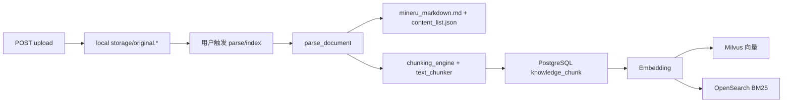

# RAGFlow 与 zs-rag 知识库构建对比与优化计划

## 1. 概述与阅读指引

### 1.1 对比范围

本文档聚焦 **RAGFlow** 与 **zs-rag** 在知识库构建、文件上传与解析入库链路上的差异，并给出可落地的后续优化路线。

**包含**：

- 经典向量知识库（Milvus + OpenSearch + PostgreSQL）的完整 ingest 流程
- LightRAG 图知识库（Neo4j）的并行路径说明
- 解析器、分块、索引增强、Chunk 运维等维度对比

**不包含**：

- Agent / 对话编排细节
- 前端 UI 交互设计（除表格展示等与 ingest 直接相关的部分）

### 1.2 相关文档

| 文档 | 说明 |
|------|------|
| [ragflow知识库分析文档.md](./ragflow知识库分析文档.md) | RAGFlow 侧完整分析（表结构、解析器、API） |
| [知识库实现对比排名.md](./知识库实现对比排名.md) | RAGFlow / WeKnora / Yuxi 三方横向对比 |
| [知识库最小化设计文档.md](./知识库最小化设计文档.md) | zs-rag 设计基线（**部分已落后于代码，以代码为准**） |
| [对话检索增强逻辑说明.md](../对话检索增强逻辑说明.md) | zs-rag 检索与 hybrid 融合逻辑 |

### 1.3 代码锚点（zs-rag）

| 模块 | 路径 |
|------|------|
| 索引编排入口 | `backend/app/services/knowledge_document_service.py` |
| 文档解析 | `backend/app/core/document_parser.py` |
| PDF OpenDataLoader | `backend/app/core/opendataloader_gateway.py` |
| PDF MinerU | `backend/app/core/mineru_gateway.py` |
| 分块引擎 | `backend/app/core/chunking_engine.py` |
| LightRAG 图 KB | `backend/app/services/lightrag_engine.py` |
| 后台任务 / 取消 | `backend/app/services/document_process_tasks.py` |
| 前端表格展示 | `web/src/lib/mineruContentDisplay.ts` |

---

## 2. RAGFlow 知识库构建全流程

RAGFlow 采用 **Ingestion Pipeline** 架构：上传后创建 Document + Task，由 TaskExecutor 调度 Parser → Chunker → Transformer → Indexer，可选 GraphRAG / RAPTOR / Mindmap 等高级索引。

### 2.1 各环节要点

| 环节 | RAGFlow 做法 |
|------|-------------|
| **上传** | `/upload`、`/web_crawl`、虚拟文档、File 树；`content_hash` 去重 |
| **解析器** | 14+ 场景模板（`rag/app/*.py`）：naive / paper / book / presentation / laws / resume / **table** / picture / email / audio 等 |
| **PDF** | DeepDoc（版面+表格）/ MinerU / Naive 纯文本；2025.10 起 Pipeline 可选 Docling |
| **表格** | 专用 `table` 解析器 + DeepDoc 表格识别；Spreadsheet 输出 **HTML** 保留行列 |
| **图片** | `picture` 解析器：OCR + 可选 VLM；PDF/DOCX 内嵌图可用多模态模型 |
| **分块** | **Template-based**：Token（默认 512）+ Title 按标题切；overlap 百分比；可解释 |
| **入库增强** | 分词、关键词提取、问题建议、内容标签、元数据生成（Transformer 节点） |
| **索引** | ES/Infinity 一体存储：向量 + BM25 分词字段 + page/position/img_id |
| **进度** | Task 表：progress / progress_msg / retry / cancel |
| **Chunk 运维** | 手动 create / set / switch / rm；改内容自动 re-embed |

### 2.2 设计特点

1. **按文档类型选模板**：知识库或文档级 `parser_id` 决定解析 + 分块策略，而非单一通用管道。
2. **表格为一等公民**：Spreadsheet → HTML；PDF 表格经 DeepDoc 结构化后再 chunk。
3. **入库语义增强**：Transformer 在索引前用 LLM 生成 keywords / questions / summary，缩小 query-document 语义鸿沟。
4. **单引擎双模检索**：ES/Infinity 同时承载向量与 BM25，通过 `vector_similarity_weight` 调节融合。

参考：[RAGFlow Ingestion Pipeline 博客](https://ragflow.io/blog/is-data-processing-like-building-with-lego-here-is-a-detailed-explanation-of-the-ingestion-pipeline)、仓库内 [ragflow知识库分析文档.md](./ragflow知识库分析文档.md)。

---

## 3. zs-rag 当前知识库构建全流程

zs-rag 入口为 `knowledge_document_service.index_document`：上传落盘后由用户触发 parse/index，经 `parse_document` → 分块 → PostgreSQL `knowledge_chunk` → Embedding → Milvus + OpenSearch 双写。图 KB 走 LightRAG 独立路径。

### 3.1 各环节要点

| 环节 | zs-rag 做法 |
|------|------------|
| **上传** | 白名单：txt / md / pdf / docx / csv / xls / xlsx / xlsm；本地路径 `storage/knowledge_files/{space}/{kb}/{doc}/` |
| **PDF 路由** | KB `config.pdf_parser`：OpenDataLoader（默认）→ MinerU → pypdf（`document_parser._parse_pdf`） |
| **Hybrid** | ODL + `pdf_parser_hybrid` + `opendataloader-hybrid` sidecar |
| **Word** | python-docx：段落 + 标题 + **表格**（`_parse_docx`） |
| **Excel** | openpyxl / xlrd：sheet → tab 分隔文本（**无 HTML 表格结构**） |
| **图片** | 解析层支持 MinerU，但**上传白名单未开放** |
| **表格入库** | 统一 `build_table_segments_from_rows`：overview + 逐行文本；`table_body_html` 供展示 |
| **表格展示** | 前端 `mineruContentDisplay.ts` + 详情页 HTML 渲染（近期已改） |
| **分块** | general（delimiter + 窗口 overlap）/ parent_child；封面合并、相邻段预算合并 |
| **索引增强** | **无** LLM 关键词 / 问题 / 摘要入库；OpenSearch `keyword_text` 来自 chunk 原文 |
| **图 KB** | LightRAG 路径跳过经典分块（`lightrag_engine.py`） |
| **Chunk 运维** | 只读 list / get；**无** 手动改 chunk / 自动 re-embed API |
| **进度** | SSE 解析流 + `parse_log_json`；`document_process_tasks.py` 支持取消 |

### 3.2 与近期改动的衔接

**表格双轨**（检索 vs 展示）是当前 zs-rag 的显著特征：

- **检索文本**：`build_table_segments_from_rows` 生成 overview（表名 + 列）与逐行扁平文本，供向量与 BM25 索引。
- **展示结构**：MinerU / ODL 的 `content_list` 与 chunk metadata 中的 `table_body_html`、`content_list_index` 供前端渲染完整 HTML 表格。
- **已知差距**：复杂研报 PDF 在 ODL 下常将表格识别为 `type:text`，导致 sidecar 无 `table_body`；MinerU 识别更完整。ODL 已补 `rows/cells` 提取与 `content_list_index` 写入。

---

## 4. 分维度对比

以下每行标注：**可借鉴** / **已具备** / **差距** / **不建议**。

### 4.1 架构与任务模型

| 维度 | RAGFlow | zs-rag | 标注 |
|------|---------|--------|------|
| 任务调度 | TaskExecutor + Task 表，异步队列 | 同步/后台 index + 状态机（parsing → chunking → indexing） | 已具备（简化版） |
| 解析器选择 | 14+ 模板工厂，按文档类型 | PDF 按 KB 配置选引擎，非按文档类型模板 | **差距** |
| Pipeline 编排 | Parser → Chunker → Transformer → Indexer 可配置 | 固定链路：parse → chunk → embed → dual index | **差距** |
| 取消 / 重试 | Task 级 cancel / retry | SSE + 取消任务 | **已具备** |

### 4.2 文件类型与解析

| 类型 | RAGFlow | zs-rag | 标注 |
|------|---------|--------|------|
| PDF | DeepDoc / MinerU / Naive + Pipeline | ODL / MinerU / pypdf | **差距**（缺 DeepDoc 级自研版面；复杂研报 ODL 弱于 MinerU） |
| DOCX | JSON 层级结构 + VLM 读图 | 段落 + 表格，无内嵌图 | **可借鉴** VLM 读 DOCX 图 |
| XLSX | HTML 保留表格 | TSV 文本 | **明显差距** |
| PPT | 逐页 JSON | 不支持 | **差距** |
| 图片 / 音频 / 邮件 | 专用解析器 | 图片解析有、上传未开；无 audio / email | **差距** |
| TXT / MD | naive 解析 | 直接读取 | **已具备** |

### 4.3 表格策略

| 维度 | RAGFlow | zs-rag | 标注 |
|------|---------|--------|------|
| 表格定位 | table 模板 / Spreadsheet→HTML / DeepDoc 表格 | overview + row 扁平文本 + sidecar HTML | **可借鉴** 结构保留 |
| 检索 vs 展示 | chunk 内保留 table 结构 / table_context | 检索文本与展示结构分离（metadata `table_body_html`） | **已具备**（近期补齐展示） |
| 整表 chunk | 支持表级块 | 仅 overview + 行块 | **可借鉴** 整表 chunk 提升表级召回 |
| Excel 表格 | HTML | TSV | **差距** |

### 4.4 分块策略

| 维度 | RAGFlow | zs-rag | 标注 |
|------|---------|--------|------|
| 模板 | 论文 / 法律 / 手册等场景模板 | general / parent_child | **差距** |
| 切分模式 | Token + Title 双模式，overlap 百分比 | delimiter + 固定字符窗口 | **已具备**（通用场景） |
| 可解释性 | 模板名 + chunk 类型可见 | chunk metadata 含 section / page 等 | **已具备** |

### 4.5 入库语义增强（Transformer）

| 维度 | RAGFlow | zs-rag | 标注 |
|------|---------|--------|------|
| 关键词 | LLM / 分词写入索引字段 | 无，BM25 用原文 | **可借鉴**（高价值） |
| 假设问题 | 自动生成 questions | 无 | **可借鉴** |
| 摘要 / 标签 | chunk 级 summary / tags | 无 | **可借鉴** |
| 跨语言 | 知识库 language 配置 | 无 | **差距** |

### 4.6 检索与索引

| 维度 | RAGFlow | zs-rag | 标注 |
|------|---------|--------|------|
| 存储 | ES/Infinity 一体 | Milvus + OpenSearch + PG | **已具备**（架构不同，**不建议**整体迁移） |
| Hybrid | vector_similarity_weight | hybrid 权重融合 | **已具备** |
| 图检索 | GraphRAG | LightRAG | **已具备**（路径不同） |
| 层次摘要 | RAPTOR | 无 | **可借鉴**（可选） |
| 跨语言检索 | 支持 | 无 | **差距** |

### 4.7 运维与可观测

| 维度 | RAGFlow | zs-rag | 标注 |
|------|---------|--------|------|
| 进度 | progress 0~1 + progress_msg | SSE 日志 + parse_log_json | **已具备**（可结构化百分比） |
| Chunk CRUD | create / set / switch / rm | 只读 list / get | **差距** |
| Embedding 切换 | 切换后检查 / 重嵌 | KB 级 embedding 配置 | **部分具备** |
| Pipeline 日志 | 节点级日志 | 解析阶段日志 | **可借鉴** |

---

## 5. 可借鉴清单（按优先级）

### P0 — 直接提升解析 / 展示质量（与近期工作衔接）

| # | 项 | 说明 | 状态 |
|---|-----|------|------|
| 1 | **PDF 按场景默认引擎** | 研报 / 多表 PDF 默认 MinerU；普通 PDF 用 ODL（KB 级或自动检测） | 部分具备（KB `pdf_parser` 配置） |
| 2 | **表格双轨 chunk** | 检索保留 row / overview；展示 / 引用用 `table_body_html`；可选「整表 chunk」 | **进行中**（metadata + 前端已改） |
| 3 | **Excel 解析升级** | sheet → HTML table（对齐 RAGFlow Spreadsheet），而非纯 TSV | **已完成**（`html_table` 默认） |
| 4 | **开放图片上传** | 白名单 + MinerU OCR，与 PDF 内图一致 | 待做 |

### P1 — 分块与入库增强

| # | 项 | 说明 |
|---|-----|------|
| 5 | **文档类型模板** | 轻量版 `parser_template`：report / manual / spreadsheet / general，映射 parser + chunking 预设 |
| 6 | **入库 Transformer** | chunk 级 keywords / hypothetical questions 写入 metadata 与 OpenSearch | **已完成**（可选开启） |
| 7 | **Chunk 运维 API** | 编辑 chunk 内容 → 触发 re-embed（参考 RAGFlow `/set`） |

### P2 — 架构演进

| # | 项 | 说明 |
|---|-----|------|
| 8 | **可编排 Ingestion Pipeline** | Parser → Chunker → Enricher → Indexer 插件化；不必一步可视化 |
| 9 | **RAPTOR 式层次摘要** | 长文档多粒度召回（可选 profile） |
| 10 | **Web 抓取 / FAQ 导入** | 按业务需要 |

### 不建议照搬

- **整体迁移至 ES/Infinity**：zs-rag 已选 Milvus + OpenSearch + PG，替换成本高。
- **14 种解析器全量复制**：应做「模板 + 引擎组合」而非 14 个独立 Python 模块。

---

## 6. zs-rag 后续优化改造计划（分阶段路线图）

与 OpenSpec / 现有 KB 设计对齐的行动计划。

### Phase 1（1–2 周）— 解析与表格体验

- [x] 固化 PDF 引擎选择策略（KB `config.parsers` + 解析器面板提示：复杂 PDF 推荐 MinerU）
- [x] 表格 HTML 展示与 `content_list_index` / `table_body_html` 入库（`mineru_gateway.py`、`opendataloader_gateway.py`、`mineruContentDisplay.ts`）
- [x] ODL `rows/cells` 提取补全（`opendataloader_gateway.py`）
- [x] 按文件类型解析器配置（`config.parsers` + `ParserSettingsPanel.vue`）

### Phase 2（2–4 周）— 结构化内容与分块模板

- [x] Excel → HTML / table segments（`html_table` 引擎 + `build_table_segments_from_rows`）
- [ ] 引入 KB `parser_template`（report / manual / spreadsheet / general）映射 parser + chunking — **不做命名预设，已由 per-type parsers 覆盖**
- [ ] 表格 chunk 策略：overview + rows + optional full-table chunk
- [ ] 图片格式加入上传白名单

### Phase 3（1–2 月）— 入库增强与运维

- [x] 可选 LLM enrichment：keywords / questions 写入 chunk metadata + OpenSearch（`chunk_enrichment_service.py` + `EnrichmentSettingsPanel.vue`）
- [ ] Chunk 编辑 + re-index API — **不做**
- [ ] 解析进度结构化（progress 百分比对齐 RAGFlow 体验）

### Phase 4（长期）— 已明确不做

- Pipeline 编排、RAPTOR、跨语言检索不在 zs-rag 路线内

---

## 附录：快速对照表

| 能力 | RAGFlow | zs-rag |
|------|---------|--------|
| 上传去重 | content_hash | 文件名 + 存储路径 |
| PDF 默认 | DeepDoc / 模板 | OpenDataLoader |
| Excel | HTML | HTML（`html_table` 默认）/ TSV |
| 表格展示 | chunk 内结构 | sidecar HTML + metadata |
| 分块模板 | 14+ parser_id | general / parent_child + per-type parsers |
| 入库 LLM 增强 | 有 | 可选（keywords + questions） |
| 向量 + 全文 | ES/Infinity | Milvus + OpenSearch |
| 图 KB | GraphRAG | LightRAG |
| Chunk 编辑 | 有 | 无 |

---

*文档版本：2026-05；基于 zs-rag 当前代码与 RAGFlow 官方 Ingestion Pipeline 资料整理。*
