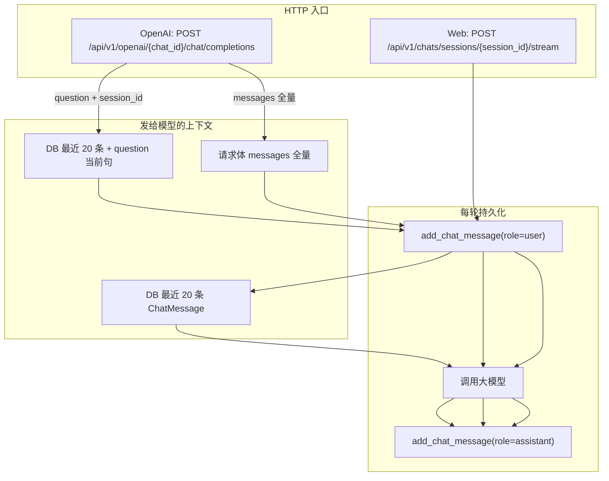

# 会话多轮历史实现说明

本文说明：**同一 `session_id` 下**，zs-rag 如何存储、读取多轮对话历史，以及 **Web 工作台** 与 **OpenAI 兼容补全** 两条路径的差异与可优化点。便于对接方选择 `messages` / `question` / `session_id` 的组合方式。

**相关文档**：

- [`聊天助手会话管理接口文档.md`](./聊天助手会话管理接口文档.md) — Session / Message REST
- [`openai接口示例.md`](./openai接口示例.md) — OpenAI 形态请求/响应样例
- [`对话检索增强逻辑说明.md`](./对话检索增强逻辑说明.md) — 检索 query 仅用本轮用户输入，不拼历史

**核心源码**：`backend/app/services/chat_service.py`（`ensure_session_for_completion`、`build_completion_messages`、`iter_chat_stream_events`、`iter_openai_completion_events`）、`backend/app/models/chat.py`。

---

## 1. 数据模型

```text
ChatConversation（对话 / chat_id）
  ├── 模型、知识库、system_prompt、temperature 等配置
  └── ChatSession（会话 / session_id）  ← 多轮消息按 session 隔离
        └── ChatMessage（id, role, content, citations?, created_at）
```

| 层级 | 说明 |
|------|------|
| **Conversation** | 顶层「聊天」；对外 OpenAI 路径中的 `{chat_id}` |
| **Session** | 其下多条会话；**历史消息挂在 session_id 上** |
| **Message** | `role` 为 `system` / `user` / `assistant`；助手消息可带 `citations` JSON |

- Session **不单独存**模型配置；读写 `.../sessions/{id}/config` 实际改的是所属 **Conversation** 的配置。
- 删除 Session 会级联删除其下所有 `ChatMessage`。

---

## 2. 总览：两条入口



---

## 3. 路径一：Web 工作台（主路径）

**接口**：`POST /api/v1/chats/sessions/{session_id}/stream`  
**请求体**：`{ "content": "本轮用户输入" }`（`ChatStreamRequest`）

**实现**：`iter_chat_stream_events`

单轮顺序：

1. 校验 `session_id` 归属当前用户 / 企业空间，且属于合法对话。
2. **`add_chat_message`** 写入本轮 **user**。
3. 从 DB 查询该 session **按 `created_at` 升序的最近 20 条**消息（已包含刚写入的 user）。
4. 转为发给大模型的 **`messages` 数组**（见下节「`messages` 数组里到底有什么」— Web 路径）。
5. 用**本轮 user 原文**做知识库检索，得到 `kb_block`；`inject_system_into_messages` 在数组**最前面**插入/保留 **system**。
6. 调用厂商 LLM **流式**生成；SSE 事件 `assistant_delta` / `assistant_done`。
7. **`add_chat_message`** 写入 **assistant**（可带 `citations`）。

**前端**（`web/src/stores/chat.ts`）：

- 选中 session 时：`GET .../sessions/{session_id}/messages` 拉取**全量**消息用于展示。
- 发送时只传本轮 `content`；**不由前端拼历史给模型**，历史由服务端从 DB 读取。

### 3.1 `messages` 数组里到底有什么？（会拼历史吗？）

**会。** Web 路径下，发给厂商 API 的 `messages` **不是**请求体里带来的（请求只有本轮 `content`），而是服务端用 **当前 `session_id` 在数据库里已落库的多轮记录**拼出来的。

#### 拼装步骤（对应源码）

```text
① DB 查询（同一 session_id，created_at 升序，最多 20 行）
   → 每行 ChatMessage 转成 { "role": msg.role, "content": msg.content }

② inject_system_into_messages(...)
   → 若第一条不是 system，则在数组最前插入一条 system（对话配置 + 本轮检索到的知识库文本）
   → 若第一条已是 system，则不再插入（不会把知识库写进已有 system）

③ 将完整 messages 传给 provider.chat_stream_chunks(model, messages)
```

对应代码（`iter_chat_stream_events`）：

```python
messages = [{"role": msg.role, "content": msg.content} for msg in history]
# ... 检索得到 kb_block ...
messages = inject_system_into_messages(messages, conv, knowledge_block=kb_block)
```

#### 数组长什么样（示例）

假设该 session 里已有 2 轮对话，用户刚发第 3 句「刚才说的数字是多少？」，且对话配置了系统提示和知识库。发给模型的数组**大致**为：

```json
[
  {
    "role": "system",
    "content": "你是助手…\n\n【知识库参考】\n片段1…\n片段2…\n（引文提示）"
  },
  { "role": "user", "content": "请记住数字 42" },
  { "role": "assistant", "content": "好的，已记住。" },
  { "role": "user", "content": "再重复一遍" },
  { "role": "assistant", "content": "42。" },
  { "role": "user", "content": "刚才说的数字是多少？" }
]
```

说明：

| 项 | 说明 |
|----|------|
| **历史从哪来** | 全部来自 **`chat_message` 表** 中该 `session_id` 的记录（含本轮刚写入的 user） |
| **是否包含 assistant** | **包含**；user / assistant 交替出现，模型靠它们理解多轮上下文 |
| **是否包含 system** | 通常 **会**在数组**最前**插入 1 条；内容 = 对话 `system_prompt` + 占位符 `{knowledge}` 替换成本轮检索块 |
| **条数上限** | 来自 DB 的 user/assistant 最多 **20 条**；再加 1 条 system 后，数组总长可能为 21 |
| **不含什么** | 不含 `citations` JSON、消息 `id`、`created_at`；不含量产外的 `developer` / `tool` 等（表里也没存） |
| **本轮 assistant** | **不在**本轮请求里；要等模型生成完后才 `add_chat_message(assistant)` 写入 DB，**下一轮**才会进入历史 |

#### 和「检索 query」的关系

- **拼进 `messages` 的**：最近 20 条 **user/assistant 全文** +（通常）一条 **system**。
- **只用于检索、不单独占一条历史的**：本轮用户输入作为 **query** 去搜知识库；检索结果写在 **system** 里，而不是把历史对话拼进检索字符串。详见 [`对话检索增强逻辑说明.md`](./对话检索增强逻辑说明.md)。

#### 常见误解

| 误解 | 实际 |
|------|------|
| 前端要在请求里带 `messages` | Web **不用**；只有 OpenAI 兼容接口才在 HTTP body 里传 `messages` |
| 有 `session_id` 就一定会读 DB 拼历史 | **仅 Web stream 与 OpenAI `question` 模式**会；OpenAI **`messages` 模式**以 body 为准，不读 DB |
| 20 条以外的更早对话模型也能看到 | **不能**；更早记录仍在 DB，可 `GET /messages` 展示，但**不会**进入本轮 `messages` |

---

## 4. 路径二：OpenAI 兼容补全

**接口**：

- 推荐：`POST /api/v1/openai/{chat_id}/chat/completions`
- 兼容：`POST /api/v1/chat/completions`（body 含 `chat_id`）

**Session 解析**：`ensure_session_for_completion`

| 请求是否带 `session_id` | 行为 |
|-------------------------|------|
| **有** | 校验存在且属于该 `chat_id`，**复用**该 Session |
| **无** | 在该对话下 **新建** Session（标题 `会话 N`，N 为当前计数 + 1） |

`session_id` 可从 JSON 根级或 `extra_body.session_id` 解析（见 `resolve_session_id_from_body`）。

### 4.1 拼上下文：`build_completion_messages`

| 请求形态 | 发给模型的 `messages` | 是否读 DB 历史 |
|----------|-------------------------|----------------|
| 有 **`messages`**（非空，末条须为 `user`） | **仅**请求中的 `messages` + 注入 system / 知识库 | **否** |
| 仅有 **`question`** | DB 最近 **20 条** + 当前 `question` 作为新 user | **是** |

### 4.1.1 OpenAI 路径下 `messages` 数组的两种来源

#### 方式 A：`question` + `session_id`（与 Web 类似，服务端拼历史）

1. 从 DB 读该 session 最近 **20 条** `ChatMessage`（**此时通常还没有本轮 user**，因为落库在后面的 `iter_openai_completion_events` 里）。
2. 转为 `[{role, content}, ...]`。
3. 在数组**末尾追加**当前 `question` 作为新的 `{ "role": "user", "content": "<question>" }`。
4. `inject_system_into_messages` 在最前插入 system（含知识库块）。
5. 再执行 `add_chat_message(user)` 把 `question` 写入 DB。

示例（第 2 轮，body 只有 `question`）：

```json
[
  { "role": "system", "content": "…知识库+系统提示…" },
  { "role": "user", "content": "请记住数字 42" },
  { "role": "assistant", "content": "好的。" },
  { "role": "user", "content": "刚才的数字是多少？" }
]
```

**结论：会拼接 DB 历史 + 当前一句，最多 20 条历史 + 1 条新 user（+ system）。**

#### 方式 B：请求体带全量 `messages`（OpenAI 标准，客户端拼历史）

1. **不查 DB** 拼模型输入；`messages` **完全以 HTTP 请求体为准**（经 `normalize_openai_messages` 清洗）。
2. 仅在第一条不是 `system` 时，服务端再 **插入一条** system（对话配置 + 本轮知识库）。
3. 仍会 `add_chat_message` 把**末条 user** 和**助手回复**写入 DB，供以后 `question` 模式或 Web 使用，但**本轮**模型看不见 DB 里比 body 更旧、却未出现在 body 里的记录。

示例（客户端自己维护历史）：

```json
[
  { "role": "user", "content": "请记住数字 42" },
  { "role": "assistant", "content": "好的。" },
  { "role": "user", "content": "刚才的数字是多少？" }
]
```

服务端可能变成（插入 system 后）：

```json
[
  { "role": "system", "content": "…" },
  { "role": "user", "content": "请记住数字 42" },
  { "role": "assistant", "content": "好的。" },
  { "role": "user", "content": "刚才的数字是多少？" }
]
```

**结论：历史由调用方拼进 `messages`；服务端不会把 DB 里多出来的旧消息再 merge 进来。**

补充规则：

- `normalize_openai_messages` 只保留 `system` / `user` / `assistant`，且丢弃空 content；`developer`、`tool` 等会被忽略。
- 末条不是 `user` 时返回 `LAST_MESSAGE_NOT_USER`（400）。
- 知识库检索的 **query** 为：有 `messages` 时取**最后一条 user**；有 `question` 时取 `question` 字符串（**不是**整段历史）。详见 [`对话检索增强逻辑说明.md`](./对话检索增强逻辑说明.md)。

### 4.2 执行与落库

- 流式：`iter_openai_completion_events`
- 非流式：`run_chat_completion_blocking`

共同步骤：

1. 使用上一步已构建好的 `llm_messages` 调模型。
2. 开始时 **`add_chat_message(user)`**（内容为 `user_content_to_persist`：末条 user 或 `question`）。
3. 结束后 **`add_chat_message(assistant)`**。
4. 响应根级回显 **`session_id`**、**`chat_id`**（zs-rag 扩展字段）。

---

## 5. 同一 `session_id`：各用法效果对照

| 用法 | 模型是否多轮 | DB 是否同一 Session | 说明 |
|------|:------------:|:-------------------:|------|
| Web `stream` + 固定 session | 是 | 是 | 标准站内路径；上下文来自 DB 20 条 |
| OpenAI：`question` + `session_id` | 是 | 是 | 服务端合并历史；`demo/openai_chat/curl_chat.sh` 默认方式 |
| OpenAI：全量 `messages` + `session_id` | 是（靠 body） | 是 | **不读** DB 拼模型输入；仍会每轮 `add_chat_message` |
| OpenAI：全量 `messages`、**无** session_id | 是（靠 body） | 否 | 每轮新建 Session；推理 OK，平台会话碎裂 |

### 5.1 OpenAI 标准：全量 `messages`、不带 `session_id`

- **模型**：只要每次请求带完整 `messages` 且末条为 `user`，**不依赖** `session_id` 即可多轮推理。
- **平台**：无 `session_id` 时每轮新建 Session；Web 里会看到多个「会话 N」。

### 5.2 仅 `question` + `session_id`（推荐服务端续聊）

- 客户端每轮只发当前一句；历史由 DB 加载（最近 20 条）再拼当前 `question`。
- 与 Web `stream` 路径在「读 DB 历史」上一致（条数限制相同）。

### 5.3 `messages` + `session_id` 的注意点

- 模型上下文 = 请求里的 `messages`，**不会**再合并 DB 中更早、但未出现在 `messages` 里的记录。
- 若 `messages` 已含本轮 user，服务端仍会 **`add_chat_message(user)`** 一次 → DB 可能出现 **重复 user 行**；后续若改用 `question` 模式，历史中可能带上重复内容。

---

## 6. 历史窗口与系统提示

### 6.1 固定 20 条消息

Web 流式与 OpenAI `question` 路径均使用：

```python
select(ChatMessage)
  .where(ChatMessage.session_id == session_id)
  .order_by(ChatMessage.created_at.asc())
  .limit(20)
```

- 限制的是 **消息条数**，不是 token；长对话易超出模型上下文。
- 约等于最近 10 轮（user + assistant 各算 1 条）。
- `GET .../messages` 可分页拉 **全量** 展示，但 **推理只用最近 20 条**。

### 6.2 系统提示注入

- 若 `messages` 第一条不是 `system`，会按 **Conversation** 配置插入系统提示（含知识库块）。
- DB 历史回放 **不包含** 以往轮次动态插入的 system 变体，仅 `user` / `assistant` 文本。

---

## 7. 与 OpenAI 官方 `id`（chatcmpl-...）的区别

响应中的 `id`（如 `chatcmpl-791c6ea0a2d149a280494c67`）表示 **单次补全请求** 的唯一标识，由 `new_completion_id()` 生成。

| 字段 | 含义 | 能否用于续聊 |
|------|------|:------------:|
| `id` / `chatcmpl-*` | 单次 HTTP 补全的 ID | 否 |
| `session_id`（zs-rag 扩展） | 平台会话 ID，对应 `chat_session.id` | **是** |

多轮续聊应使用 **`session_id`**（或 OpenAI 标准下客户端维护全量 **`messages`**），不要用 `chatcmpl-*` 当会话键。

---

## 8. 可优化点（现状与建议）

### 8.1 行为不一致（优先）

| 现状 | 建议 |
|------|------|
| 有 `session_id` 且传 `messages` 时不读 DB | 文档约定「messages = 纯 OpenAI」；或实现「DB 底稿 + messages 覆盖/追加」 |
| `iter_chat_stream_events` 与 `build_completion_messages` 各写一套取历史 + 注入逻辑 | 抽取 `load_session_messages_for_llm(session_id, limit)` 共用 |

### 8.2 历史窗口

| 现状 | 建议 |
|------|------|
| 硬编码 `limit(20)` | 对话级配置 `max_history_messages`；按 **token** 从后往前截断 |
| 消息量大时 `order_by asc + limit 20` 可能非最优 | 子查询「取最近 N 条再正序」 |

### 8.3 落库重复

| 现状 | 建议 |
|------|------|
| OpenAI 路径在已有全量 `messages` 时仍 `add_chat_message(user)` | 去重：与末条 user 相同则跳过；或扩展 `persist: false` |

### 8.4 请求参数未生效

| 现状 | 建议 |
|------|------|
| OpenAI 请求体 `temperature` / `max_tokens` / `top_p` 未传入补全 | 以 Conversation 为准并写清文档；或支持请求级覆盖 |

### 8.5 并发与产品体验

| 现状 | 建议 |
|------|------|
| 同一 `session_id` 并发请求可能交叉写消息 | Session 级锁或版本号 |
| UI 展示全量历史，模型只用 20 条 | 界面提示「模型仅记忆最近 N 轮」；可选摘要旧对话写入 system |

### 8.6 角色与结构化内容

| 现状 | 建议 |
|------|------|
| 仅文本 `system/user/assistant` | 扩展 `tool_calls`、多模态等需改表或存 `raw` JSON |

---

## 9. 对接示例

### 9.1 服务端续聊（question + session_id）

```bash
# 首轮
curl -sS -X POST "$BASE/api/v1/openai/$CHAT_ID/chat/completions" \
  -H "Authorization: Bearer $KEY" \
  -H "Content-Type: application/json" \
  -d '{"model":"deepseek-chat","question":"记住数字 42","stream":false}' | jq .

# 次轮（使用响应中的 session_id）
curl -sS -X POST "$BASE/api/v1/openai/$CHAT_ID/chat/completions" \
  -H "Authorization: Bearer $KEY" \
  -H "Content-Type: application/json" \
  -d '{"model":"deepseek-chat","question":"刚才的数字是多少","session_id":"<session_id>","stream":false}'
```

也可使用仓库内脚本：`demo/openai_chat/curl_chat.sh`（见 [`demo/openai_chat/README.md`](../demo/openai_chat/README.md)）。

### 9.2 OpenAI 标准（全量 messages，可不传 session_id）

```json
{
  "model": "deepseek-chat",
  "stream": true,
  "messages": [
    { "role": "user", "content": "记住数字 42" },
    { "role": "assistant", "content": "好的。" },
    { "role": "user", "content": "刚才的数字是多少？" }
  ]
}
```

### 9.3 LangChain 封装

见 `demo/openai_chat/langchain_zs_rag.py` 中的 **`ZsRagChatSession`**：

- 默认：客户端累积 `messages` + 复用 `session_id`。
- `server_history=True`：仅发 `question`，历史由服务端 DB 合并。

---

## 10. 小结

| 问题 | 答案 |
|------|------|
| 同一 `session_id` 历史存在哪？ | `chat_message` 表，按 `session_id` + `created_at` |
| Web 多轮靠什么？ | 每轮只发 `content`；服务端读 DB 最近 20 条 |
| OpenAI 多轮靠什么？ | `question` + `session_id` 读 DB；或客户端全量 `messages` |
| `session_id` 是 OpenAI 标准吗？ | **否**，zs-rag 扩展；官方多轮靠 `messages` |
| 检索会用历史吗？ | **否**，仅用本轮 user / question（见检索增强说明） |
